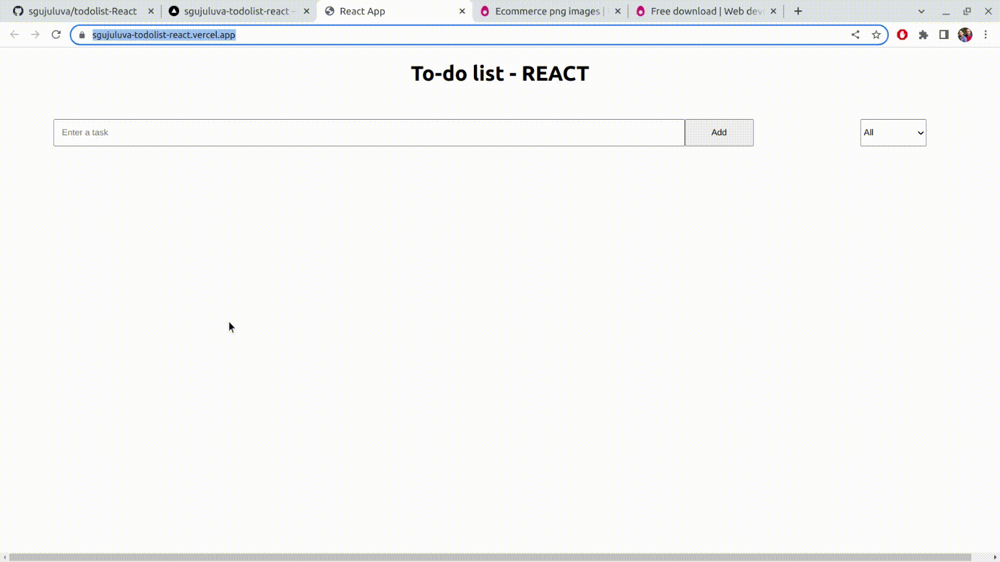

## To-Do-List App using REACT

**[Test this app yourself](https://sgujuluva-todolist-react.vercel.app/)**

---

  
---

### About Project

To do List app is created using REACT.  Here you can add the items you want to do and keep a track of it, either it is completed or not. There is a visibilty to see all the added items and can check the completed and uncompleted tasks. There is an option to delete the item.

### How to use this Project

Please add the items wanted to do and click on the ADD button. Once the button is clicked the item is displayed on the UI with a Tick button and close button. User has the ability to check the button once the task is completed. If not completed, you can click the X button to remove the item from the list. There is a dropdown menu to see ALL, Completed, Uncompleted items.

##### Developed With

- [x] _HTML5_
- [x] _CSS3_
- [x] _JavaScript_
- [x] _React_
- [x] _npm_

---

### Contact

Mail: <sanghee04@gmail.com> 
GitHub: [sgujuluva](https://github.com/) 

---

### Used Tools

- [icons](https://flaticons.com)
- [Canva](https://www.canva.com/)
- [npm](https://www.npmjs.com/)
- [Google Fonts](https://fonts.google.com/)
- [Visual Studio Code](https://code.visualstudio.com/)

---

Made with ❤️ by Sangeetha
